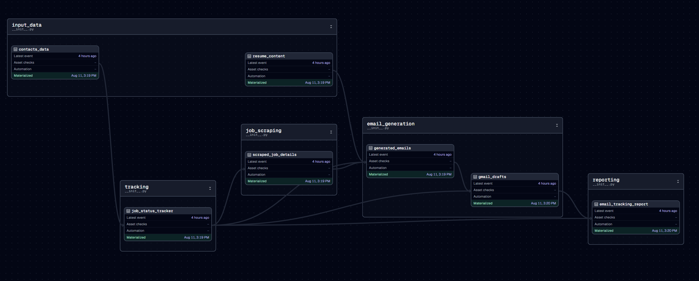

# Cold Email Automation Project (Dagster Workflow)

Last Updated: August 11, 2025

## Overview
This project automates the cold email process for job applications using a Dagster workflow. It scrapes job details from links, generates personalized emails, creates Gmail drafts, and tracks the status of applications.

## Workflow



## Features
- Job details scraping from provided links
- Resume-based personalized email generation with AI
- Gmail draft creation via Gmail API
- Complete job application status tracking
- Progress reporting and analytics

## Tech Stack

### Core Technologies
- **Python 3.9+**: Primary programming language
- **Dagster**: Workflow orchestration framework for data pipelines
- **Pandas**: Data manipulation and analytics
- **Asyncio**: Asynchronous I/O for concurrent operations
- **JSON/Excel**: Data storage and reporting formats

### APIs and Services
- **Gmail API**: For creating email drafts with OAuth2 authentication
- **Google Cloud Platform**: For API authentication and credentials
- **Gemini API**: Google's generative AI for email content creation
- **Crawl4AI**: Headless browser API for web scraping job details

### Web Scraping & Automation
- **Playwright**: Browser automation (used by Crawl4AI)
- **BeautifulSoup4**: HTML parsing and data extraction

### Development & Deployment
- **Python virtual environments**: Dependency isolation
- **Git & GitHub**: Version control and code management
- **VS Code**: Integrated development environment
- **PowerShell**: Command-line interface for Windows

### Libraries & Frameworks
- **google-auth**: Authentication with Google services
- **google-api-python-client**: Gmail API client
- **python-dotenv**: Environment variable management
- **openpyxl**: Excel file generation
- **dataclasses**: Structured data modeling

## Required Files
- `dagster_dir/assets.py`: Dagster workflow definition
- `dagster_dir/models.py`: Data models for the workflow
- `job_email_generator.py`: Email generation functionality
- `job_scraper.py`: Job scraping functionality
- `credentials.json`: Google API credentials (required)
- `token.pickle`: OAuth token storage (auto-generated)
- `resume.txt`: Your resume content for personalization
- `contacts.csv`: Input data with job links and contact information

## Required Setup

1. **Install Dependencies**
```bash
# Core dependencies
pip install google-auth-oauthlib google-auth-httplib2 google-api-python-client google.generativeai pandas python-dotenv crawl4ai

# Install Playwright browsers (required for crawl4ai)
playwright install

# Dagster integration
pip install dagster dagster-webserver dagster-pandas openpyxl
```

2. **Configure API Credentials**
   - Place your `credentials.json` file (from Google Cloud Console) in the root directory
   - Add your API keys to `.env` file:
   ```
   GEMINI_API_KEY=your_gemini_api_key_here
   CRAWL4AI_API_KEY=your_crawl4ai_api_key_here
   ```

3. **Prepare Data Files**
   - Create `contacts.csv` with required columns:
     - employer_name
     - employer_role
     - email_id
     - job_link
   - Add your resume content to `resume.txt`

## Usage Instructions

1. Set up all required credentials and files
2. Update your resume in `resume.txt`
3. Prepare your contacts data in `contacts.csv`
4. Start the Dagster UI:
```bash
python -m dagster dev
```

5. Open the Dagster UI in your browser (http://localhost:3000)
6. Run the desired assets:
   - `contacts_data`: Load contact information
   - `job_status_tracker`: Initialize tracking system
   - `scraped_job_details`: Scrape job details
   - `resume_content`: Load resume content
   - `generated_emails`: Generate cold emails
   - `gmail_drafts`: Create Gmail drafts
   - `email_tracking_report`: Generate status reports

The Dagster UI provides:
- Visual workflow management
- Detailed execution tracking
- Excel report generation
- Comprehensive job application status tracking
- Error handling and notifications

## Output Files
- `job_details_scraped.xlsx`: Scraped job details report
- `generated_emails.xlsx`: Generated email content report
- `job_tracking_report.xlsx`: Comprehensive status report
- `job_status.json`: Job application status tracking data

## Next Steps
- Implement rate limiting for API calls
- Add email tracking functionality
- Add scheduling features for email sending
- Implement A/B testing for email content
- Enhance visualization of job application metrics
